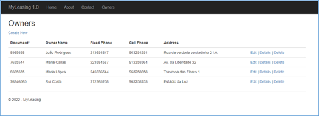
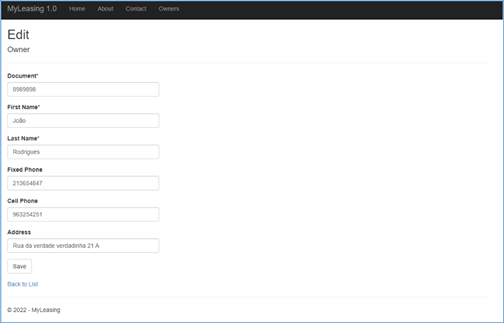
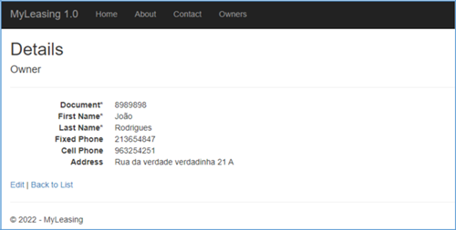
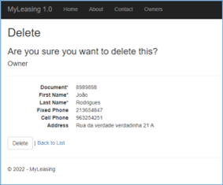
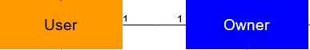

# MyLeasing


## Exercício – 1.ª parte

### Final do vídeo 6

1. Crie no seu GitHub um repositório novo com o nome MyLeasing.

O formador Rafael Santos (rafaelsantos1000) deverá ter acesso também a esse repositório. Envie convite

2. Crie uma solução vazia (Blank Solution) com o nome MyLeasing.

3. Na solução anterior crie a Library standard com o nome MyLeasing.Common.

4. De seguida crie na mesma solução um projecto ASP.NET MVC com o nome MyLeasing.Web.

5. Faça o commit com a mensagem Init Project.

6. Na aplicação web deverá criar os seguintes links: Home, About, Contact, Owners. Veja a figura abaixo como deverá
   ficar.

7. Na aplicação web crie as vistas representadas em baixo, bem como a respetiva base de dados e tabela de suporte,
   tornando funcional o CRUD dos Owners (Proprietários).

Faça commit no final deste ponto com a mensagem CRUD Owners.


Figura 1 - vista index do controlador Owners


Figura 2 - vista edit do controlador Owners


Figura 3 - vista details do controlador Owners


Figura 4 - vista delete do controlador Owners

8. Crie uma alimentador automático da base de dados, para que, sempre que esta for eliminada, quando a aplicação
   arrancar, seja novamente criada já com 10 proprietários inseridos.

Faça novo commit com o texto SeedDb

## Exercício – 2.ª parte

### Final do vídeo 7

1. Implemente no projeto o padrão Repository, fazendo depois o respetivo commit.

## Exercício – 3.ª parte

### Final do vídeo 10

1. Implemente no projeto um padrão Repository mas agora genérico, fazendo depois o respetivo commit.

2. Extenda a classe User da IdentityUser acrescentando as seguintes propriedades e anotações :

```csharp

[Display(Name = "Document")]

[MaxLength(20, ErrorMessage = "The {0} field can not have more than {1} characters.")] [Required(ErrorMessage = "The field {0} is mandatory.")]
public string Document { get; set; }

[Display(Name = "First Name")]

[MaxLength(50, ErrorMessage = "The {0} field can not have more than {1} characters.")] [Required(ErrorMessage = "The field {0} is mandatory.")]
public string FirstName { get; set; }

[Display(Name = "Last Name")]

[MaxLength(50, ErrorMessage = "The {0} field can not have more than {1} characters.")] [Required(ErrorMessage = "The field {0} is mandatory.")]
public string LastName { get; set; }

[MaxLength(100, ErrorMessage = "The {0} field can not have more than {1} characters.")] public string Address { get; set; }

public string FullName => $"{FirstName} {LastName}";

public string FullNameWithDocument => $"{FirstName} {LastName} - {Document}";

```

3. Atualize os Owners não esquecendo que são também users, respeitando o seguinte DER:



4. Atualize o Seed por forma a criar por defeito um user á sua escolha e faça commit.

5. Crie uma API que devolva todos os Owners existentes. Faça o respetivo commit.

## Exercício – 4.ª parte

### Final do vídeo 12

1. Implemente no projecto a funcionalidade de se poder inserir/editar/ver nos Owners uma foto de perfil.

2. Implemente a entidade Lessee (inquilino) com as seguintes propriedades:

```csharp
[Display(Name = "Full Name with Document")]
    public string FullNameWithDocument =>
        $"{FirstName} {LastName} - {Document}";

    [Key] public int Id { get; set; }
    public bool WasDeleted { get; set; }


    [DisplayName("Document*")]
    [MaxLength(20,
        ErrorMessage =
            "The {0} field can not have more than {1} characters.")]
    [Required(ErrorMessage = "The field {0} is mandatory.")]
    public string Document { get; set; }


    [DisplayName("First Name*")]
    [MaxLength(50,
        ErrorMessage =
            "The {0} field can not have more than {1} characters.")]
    [Required(ErrorMessage = "The field {0} is mandatory.")]
    public string FirstName { get; set; }


    [DisplayName("Last Name*")]
    [MaxLength(50,
        ErrorMessage =
            "The {0} field can not have more than {1} characters.")]
    [Required(ErrorMessage = "The field {0} is mandatory.")]
    public string LastName { get; set; }


    [DisplayName("Profile Photo")] public string? ProfilePhotoUrl { get; set; }

    public string? ProfilePhotoFullUrl =>
        string.IsNullOrEmpty(ProfilePhotoUrl)
            ? "~/images/PlaceHolders/legacy.png"
            : MyRegex().Replace(ProfilePhotoUrl,
                "https://storage.googleapis.com/" +
                "supershoptpsicet77-nuno/lessees/");


    public Guid ProfilePhotoId { get; set; }

    public string ProfilePhotoIdUrl => ProfilePhotoId == Guid.Empty
        ? "https://supershopweb.blob.core.windows.net/noimage/noimage.png"
        : "https://storage.googleapis.com/supershoptpsicet77-nuno/lessees/" +
          ProfilePhotoId;

    [DisplayName("Fixed Phone")] public string? FixedPhone { get; set; }


    [DisplayName("Cell Phone")] public string? CellPhone { get; set; }


    [MaxLength(100,
        ErrorMessage =
            "The {0} field can not have more than {1} characters.")]
    public string? Address { get; set; }


    [DisplayName("Owner Name")]
    public string FullName => $"{FirstName} {LastName}";


    [Required] public User User { get; set; }

    [GeneratedRegex("^~/lessees/images/")]
    private static partial Regex MyRegex();

```

3. Implemente o CRUD dos Lessee’s não esquecendo que deverá manter o padrão Repository, e que estes também são Users.

4. Atualize o Seed por forma a gerar 5 Lessee’s ao reconstruir a base de dados.

## Exercício – 5.ª parte

### Final do vídeo 15

1. Crie “Blob Containers” para as imagens de perfil, tanto dos Owners como dos Lessess.

2. Optimize o código por forma a fazer uso de vistas parciais.

3. Publique no Azure e envie o link pela conversa privada do Teams.

4. Implemente o projecto Global Games usando um projecto ASP.NET MVC, tendo em conta o seguinte:
    1. Deverá usar o controller Home com três actions para as páginas Home, Sobre e Serviços.
    2. Deverá criar uma base de dados com duas tabelas. Uma para apenas guardar o email inserido para subscrever a
       newsletter, e outra para os dados inseridos no formulário orçamento.
    3. A zona da newsletter, como aparece nas três páginas, deverá ser uma vista parcial, com a sua própria action.
    4. O projecto já tem todo o seu design completo e está responsivo. Deve continuar assim, não podendo o front-end
       sofrer qualquer alteração e não esquecendo que tudo o que é comum poderá ser um layout partilhado.
    5. Publique o site e envie o respetivo link pela conversa privada.

## Exercício – 6.ª parte

### Final do vídeo 18

1. Em ambos os projectos, MyLeasing e GlobalGames, crie as seguintes funcionalidades:
    1. Login e logout
    2. Registar-se como user, passando a partir de aí poder já efetuar login.
    3. Alterar os dados.

## Exercício – 7.ª parte

### Final do vídeo 21

1. No projeto MyLeasing crie os três roles (Admin, Owner e Lessee) atualizando o respetivo Seed.

2. Apenas o Admin pode aceder ao CRUD total tanto dos Owners como dos Lessees, não devendo para estes, sequer aparecer
   os links do menu.

3. Implemente um menu do tipo dropdown para o user administrador ter as opções dos Owners e Lessees.